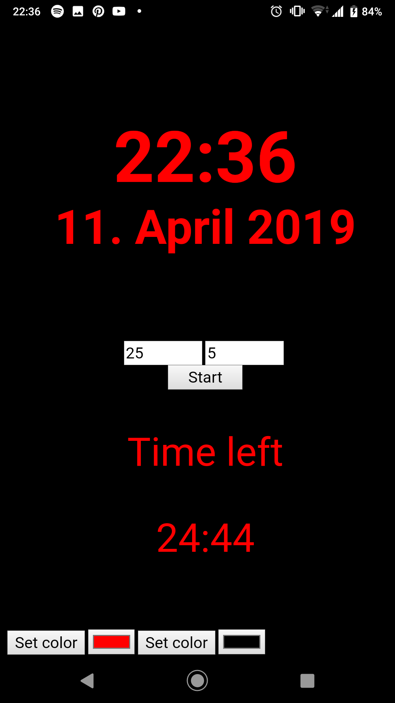
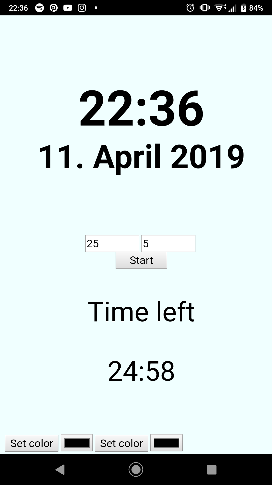

## Timer ja kell
  On võimalik sisestada taimeri väljadesse soovitud minutid ja sekundid. Saab muuta nii teksti kui tausta värvi.
### Projekti seadistamine
- Lae projekt alla Githubist
- Unzipi folder ja liigu PowerShellis projekti kausta
- Kirjuta PowerShelli käsk: npm install
- Kirjuta PowerShelli käsk: cordova run android
###Juhend
Otseselt ühtegi juhendit ei kasutanud. Otsisin erinevate asjade kohta googlest ja stackoverflow-st.
###Screenshotid

